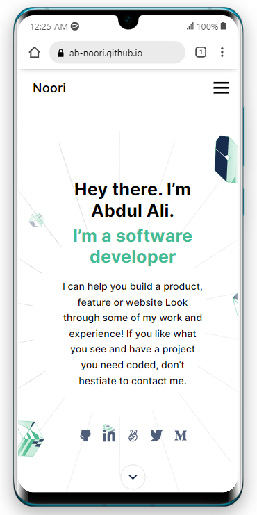
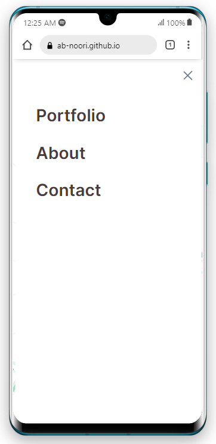

<!-- Open pull request using the following structure

  ## Project title: subtitle

  ### 🌟Branch features:

  - i
  - ii
  - iii

  ### [ 🚀 Branch Demo](https://ab-noori.github.io/Project-Template/)

-->

> # Portfolio

| Project Veiw Screenshots|
|---------------------------------------|
|

|
|

|

# 📗 Table of Contents

- [📖 About the Project](#about-project)
  - [🛠 Built With](#built-with)
    - [Tech Stack](#tech-stack)
    - [Key Features](#key-features)
  - [🚀 Live Demo](#live-demo)
- [💻 Getting Started](#getting-started)
  - [Setup](#setup)
  - [Prerequisites](#prerequisites)
  - [Install](#install)
  - [Usage](#usage)
  - [Deployment](#triangular_flag_on_post-deployment)
- [👥 Authors](#authors)
- [🔭 Future Features](#future-features)
- [🤝 Contributing](#contributing)
- [⭐️ Show your support](#support)
- [🙏 Acknowledgements](#acknowledgements)
- [❓ FAQ (OPTIONAL)](#faq)
- [📝 License](#license)

# 📖 [My-Portfolio] 

> **[My-Portfolio]** is a project to showcase all of my recent work. It will maitain the information and history of my recent projects,
 the brave informatin about me, and the link to my resume. it will also provide the context to be in contact with the clients.

## 🛠 Built With 

### Tech Stack 

  
Client

  <ul>
    <li><a href="#">HTML</a></li>
    <li><a href="#">CSS</a></li>
    <li><a href="#">JAVASCRIP</a></li>
  </ul>

  
Server

  <ul>
    <li></li>
  </ul>

Database

  <ul>
    <li></li>
  </ul>

### Key Features 
- **[Represent most recent projcts]**
- **[Represnt skills and technogies]**
- **[Create contact context for visitors]**
- **[Responsive with the view of desktop and mobile]**

(<a href="#readme-top">back to top</a>)

## 🚀 Live Demo 

- [Live Demo Link](https://ab-noori.github.io/Portfolio)

(<a href="#readme-top">back to top</a>)

## 💻 Getting Started 

To get a local copy up and running, follow these steps.

### Prerequisites

In order to run this project you need:
- A Nude.js installed on your local system.
- A browser of you choice.
- A text editor of your choice.

### Setup

Clone this repository to your desired folder:

Use the following Commands:
  - cd your-desired-folder
  - git clone git@github.com:ab-noori/My-Portfolio.git

### Install

Install this project with:
  - You can deploy it with your hosting provider of your choise.

### Usage

- To demonstrate your skills & knowlege of technoly.
- To represent the most recent project.
- to maitain connection with visitors.

### Deployment

You can deploy this project using:
- Free deployment services like GitHub pages.
- Any deployment services of your choice.

(<a href="#readme-top">back to top</a>)

## 👥 Authors 

👤 **Abdul Ali Noori**

- GitHub: [@ab-noori](https://github.com/ab-noori)
- Twitter: [@AbdulAliNoori4](https://twitter.com/AbdulAliNoori4)
- LinkedIn: [abdul-ali-noori](https://www.linkedin.com/in/abdul-ali-noori-384b85195/)

(<a href="#readme-top">back to top</a>)

## 🔭 Future Features 
- [ ] **[Responsiveness with the all kind of laptop and handheld devices viewport]**

(<a href="#readme-top">back to top</a>)

## 🤝 Contributing 

Contributions, issues, and feature requests are welcome!

Feel free to check the [issues page](../../issues/).

(<a href="#readme-top">back to top</a>)

## ⭐️ Show your support 

If you like this project, you are most welcome to Contribute.

(<a href="#readme-top">back to top</a>)

## 🙏 Acknowledgments 

I would like to thank all of My colleagues and supporters.

(<a href="#readme-top">back to top</a>)

(<a href="#readme-top">back to top</a>)

## 📝 License 

This project is [MIT](./LICENSE) licensed.

(<a href="#readme-top">back to top</a>)

